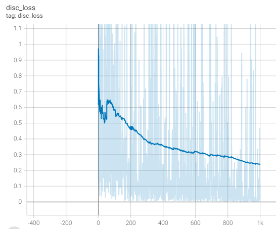
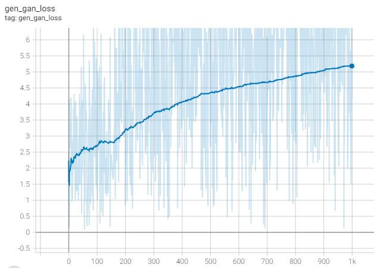

# Pix2Pix 구현해보기

[텐서플로 공식 튜토리얼](https://www.tensorflow.org/tutorials/generative/pix2pix)을 보고 [Sketch2Pokemon Dataset](https://www.kaggle.com/norod78/sketch2pokemon)에 적용시켜보는 프로젝트

### 진행 상황

- 2021-03-28 : 프로젝트 시작
- 2021-03-28 ~ 2021-03-29 : 첫 번째 모델 학습 및 결과 확인
- 2021-03-29 ~ 2021-03-30 : 두 번째 모델 학습 및 결과 확인
- 2021-03-30 ~ : 모델 서비스화 진행 중

기존에 AIFFEL 노드에서 학습했던 방법으로 잘 학습이 되지 않아서 공식 튜토리얼을 보고 다시 따라하였다.

기존과의 차이점이라고 한다면 이미지를 Normalize 해주는 시점이 조금 다르다는 것이다. 아마 이 부분에서 문제가 생겨서 위와 같은 이미지가 학습된 것으로 보인다.

이미지 데이터를 다룰 때에는 항상 Normalize, Denormalize에 신경써야 하는 것 같다. 어떤 Activation Function을 사용하느냐에 따라 Normalize 범위를 [-1, 1]로 할지, [0, 1]로 할지가 결정되기 떄문이다. 이번에 사용된 모델에서는 tanh를 Activation Function으로 사용했기 때문에 [-1, 1]의 범위에서 Normalize 해주었다.

우선 시작부터 1000 epoch 정도를 돌려보고 시작하기로 했다.

- 400 epoch 정도 부터 큰 변화가 없는걸로 보아 local minima에 빠졌거나 학습이 종료된 것 같다.
- 750 epoch 의 checkpoint를 불러와서 기울기를 1/10으로 줄여서 50 epoch 정도 더 학습을 시켜보았으나 큰 변화는 없는 것 같다.
- 750 epoch 의 checkpoint를 불러와서 기울기를 10배로 늘려서 50 epoch 정도 더 학습을 시켰더니 오히려 원하지 않는 방향으로 학습이 진행되었다.

## 결과

- 1000 epoch
- Discriminator Loss

- Generator Loss

두 Loss를 비교해봤을 때, disc_loss는 감소하고 gen_loss는 증가하는 것으로 보아 generator가 discriminator를 속이기 위한 이미지를 잘 생성하지 못하는 것으로 판단된다. 실제로 train과 test에 없는 전혀 새로운 이미지를 입력했을 때, 다음과 같이 잘 생성하지 못하는 결과를 보여줬다.

학습 과정을 시각화해보면 다음과 같다.

기존에 있는 이미지는 원본이랑 비슷한 정도로 생성하는 것으로 보아 train set에 overfitting 된 것 같다. 추가로 다른 데이터셋을 더 활용하거나, 모델의 구조를 바꾸어서 다시 학습시켜봐야겠다.
